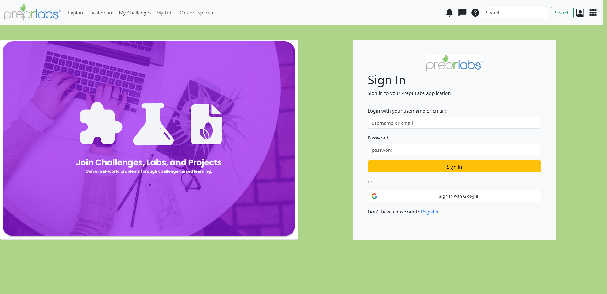
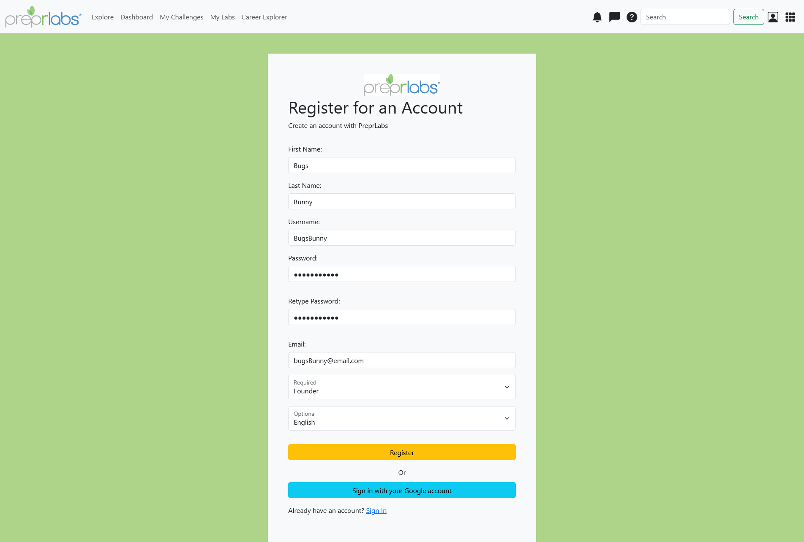
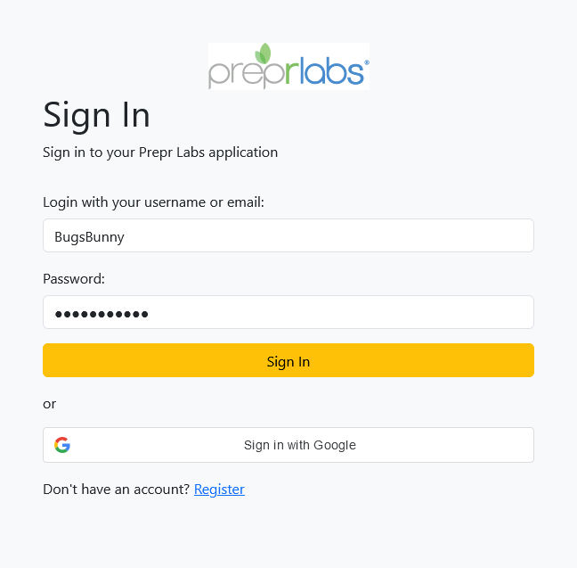
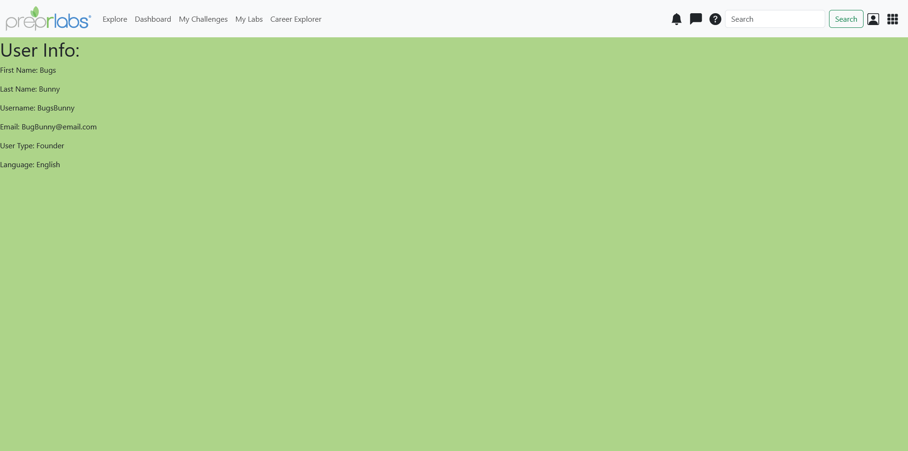
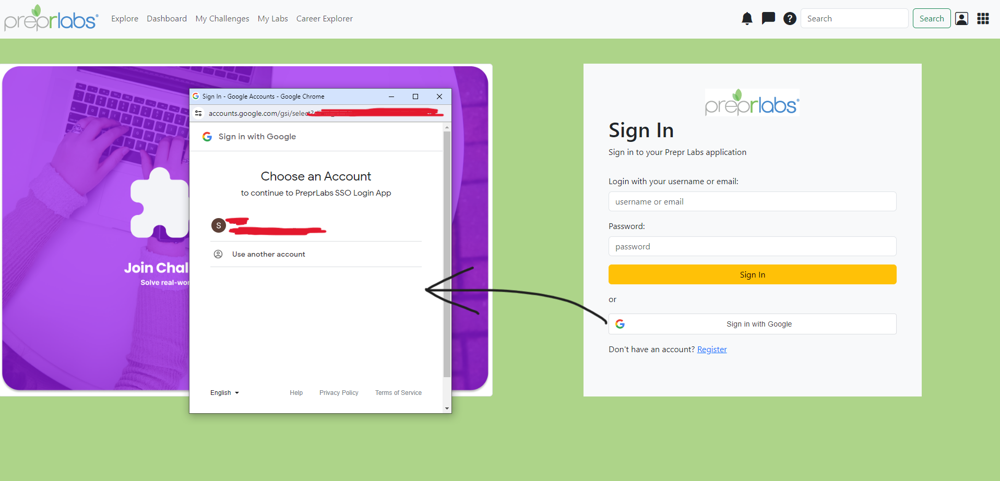
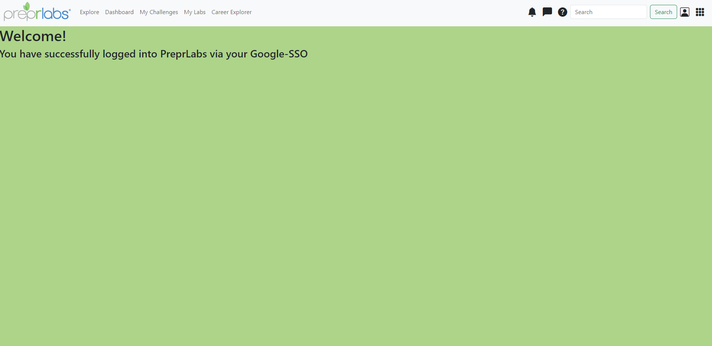

# Frontend-Developer-Challenge-2-Login-System
PreprLabs login and registration page made with React, Redux, Django, and PostgreSQL. 

Login into your PrepLabs account using your username or email, or by Google SSO. Register an account if you do not have an account.

## Tech-Stack and Tools
- Django
- Django rest_framework
- Django corsheaders
- Django allauth (for SSO Google login)
- React
- Redux
- React Router
- Bootstrap
- PostgreSQL
- Postman (for API testing)
- Visual Studio Code

## Video Demos
- Challenge 2 video demo (part 1) <a href='https://drive.google.com/file/d/1Oy_XRE6djYwf-C2lSysdcNuC3ZYt4LkH/view?usp=sharing' target="_blank">Click here</a> 
  
- Challenge 2 video demo (part 2) <a href='https://drive.google.com/file/d/1l8gpG1vdhcw9GCCFyxoSwotTdgtwiSvg/view?usp=sharing' target="_blank">Click here</a> 

## Screenshots
Login Page

Register an Account

Login Attempt - User BugsBunny

Login Success - Loads User BugsBunny Info

Google SSO Login Attempt 

Google SSO Login Success 
